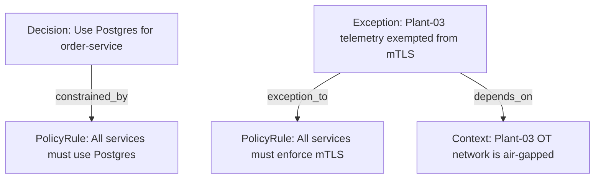
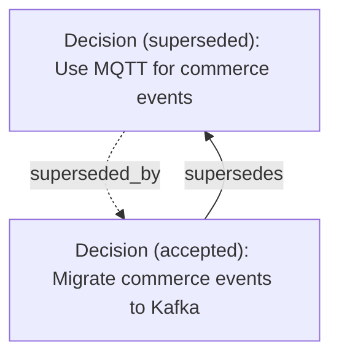
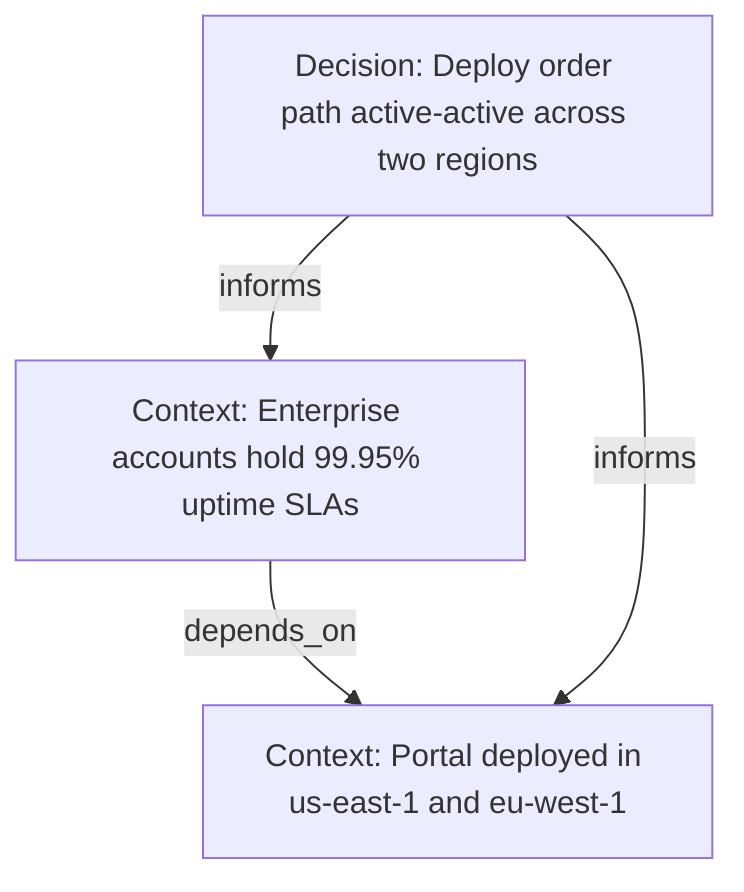
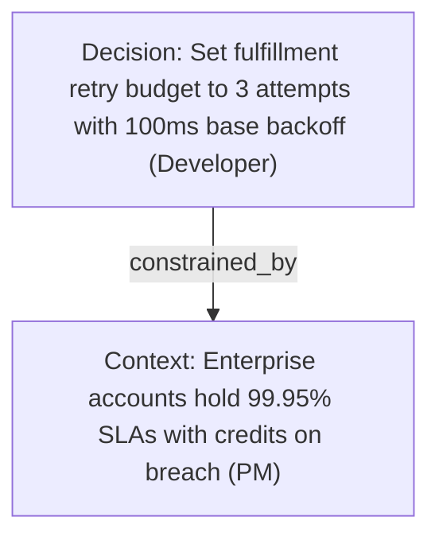
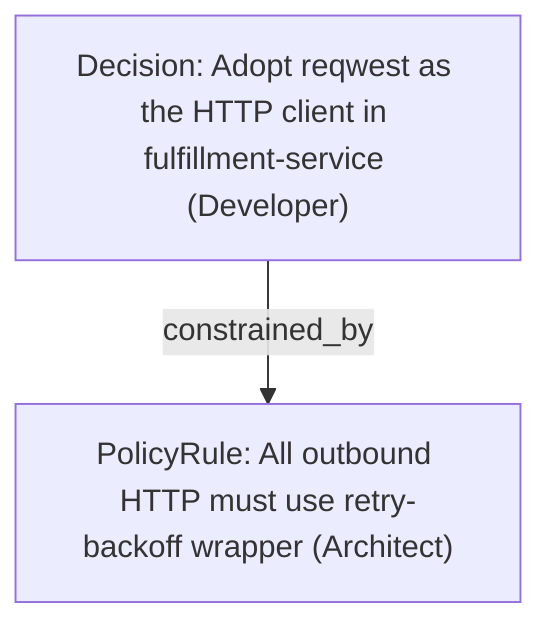
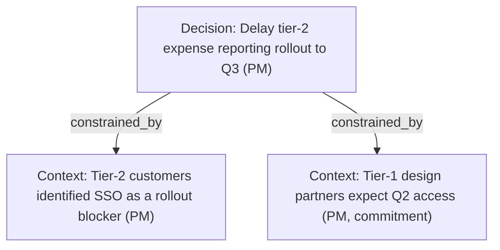

# Memory Bank Model

Architecture overview for the memory bank. This is the condensed version; each section points to the full spec file for deeper detail.

## Reading Order

The numbered files build on each other:

1. [00-retrieval-model.md](00-retrieval-model.md): How agents find records. Explains why the schema is shaped the way it is.
2. [01-base-memory-record.md](01-base-memory-record.md): The shared schema every record extends.
3. [02-decision.md](02-decision.md): The Decision type.
4. [03-policy-rule.md](03-policy-rule.md): The PolicyRule type.
5. [04-exception.md](04-exception.md): The Exception type.
6. [05-context.md](05-context.md): The Context type.
7. [06-relationships.md](06-relationships.md): How records link to each other.

For authorship in your own voice (when you write records, what they look like filled in by your role), see the per-persona hydration guides: [Architects](../guide/by-persona/architects.md), [PMs / POs](../guide/by-persona/pms.md), [Developers](../guide/by-persona/developers.md). Start there if you want to see yourself in the model before reading the schema files.

## Authorship Map

The four types apply to every role. What changes is the moment that produces the record and the language that fills the fields.

| Persona                | Decision                                                                            | Context                                                                          | PolicyRule                                                              | Exception                                                           |
| ---------------------- | ----------------------------------------------------------------------------------- | -------------------------------------------------------------------------------- | ----------------------------------------------------------------------- | ------------------------------------------------------------------- |
| **Architect**          | Architectural choice made under constraints (event sourcing, persistence, topology) | System fact learned or confirmed (air-gapped network, canonical source of truth) | Standing architectural pattern (Postgres standard, mTLS baseline)       | Granting or documenting a sanctioned technical deviation            |
| **PM / Product Owner** | Prioritization call, scope boundary, launch sequencing                              | Customer/market fact, segment truth, commitment (tag as `commitment`)            | Product principle (self-serve promise, tier gating)                     | Customer- or release-specific carve-out against a product principle |
| **Developer**          | Library/tool choice, implementation pattern with reach                              | Gotcha, performance characteristic, vendor behavior                              | Team practice codified as a standard (all HTTP calls through a wrapper) | Workaround accepted against a team or enterprise standard           |

The deeper version (triggers, field-fill cheat sheets, and full worked records for each cell) lives in the per-persona hydration guides: [Architects](../guide/by-persona/architects.md), [PMs / POs](../guide/by-persona/pms.md), [Developers](../guide/by-persona/developers.md).

## The Retrieval Model

Retrieval happens in two passes:

1. The **scope pass** reads frontmatter and filters on structured fields (`memory_type`, `applies_to`, `status`, `tags`) to narrow the universe to a handful of candidates.
2. The **content pass** reads the bodies of those few survivors and synthesizes an answer.

**This is why frontmatter matters so much**: a record with thin frontmatter is invisible to the scope pass, no matter how well-written its body is. Structured fields are the interface to the agent, not decorative metadata.

### The Four-Stage Retrieval Funnel

When an agent queries the memory bank, it should follow this funnel — cheapest operations first:

| Stage | Operation             | Cost                   | What it does                                      |
| ----- | --------------------- | ---------------------- | ------------------------------------------------- |
| 1     | Glob on filenames     | Zero content loaded    | Narrow by type (subfolder), slug, date            |
| 2     | Grep on frontmatter   | Lines 1–15 per file    | Filter structured fields without loading bodies   |
| 3     | Frontmatter-only read | ~300 tokens per record | Pull just the YAML header of surviving candidates |
| 4     | Full body read        | Full token cost        | Only for the 3–5 records that actually matter     |

Anti-pattern: reading every record in full to find matches. If you're doing this, go back to stage 1.

Full spec: [00-retrieval-model.md](00-retrieval-model.md)

## The Base Record

Every record is a Markdown file with YAML frontmatter and a prose body. The frontmatter is authoritative; the body is supporting detail for humans. The base schema carries:

- Identity (`id`, `uuid`)
- Lifecycle (`status`, `effective_from`, `effective_to`)
- Provenance (`owners`, `source_refs`)
- Scope (`applies_to`, `tags`)
- Relationships (`related`, `supersedes`, `superseded_by`)

Fields come in three tiers: **required**, **recommended**, and **optional**. The required tier is small so that adoption is not blocked by field fatigue.

Full spec: [01-base-memory-record.md](01-base-memory-record.md)

## The Four Types

### Decision

A Decision captures a choice made at a point in time. It answers _why is it built this way?_ Decisions map directly onto ADRs, which makes them a natural entry point for teams already familiar with architecture decision records. A Decision adds `decision_question`, `decision_outcome`, `alternatives_considered`, `decision_drivers`, and `approved_by` on top of the base schema.

**Rule of thumb:** if a reasonable person could have picked a different option and this record says which one was picked, it's a Decision.

Full spec: [02-decision.md](02-decision.md)

### PolicyRule

A PolicyRule captures standing guidance: _this is how we do things_. Where a Decision is retrospective, a PolicyRule is forward-looking and imperative. The required fields are `rule_statement` and `enforcement` (one of `required`, `recommended`, or `advisory`). The `enforcement` tier shapes how agents behave: a `required` rule is a hard constraint at generation time; an `advisory` rule is context the agent surfaces without acting on it.

Full spec: [03-policy-rule.md](03-policy-rule.md)

### Exception

An Exception captures a **sanctioned deviation from a PolicyRule**. Every Exception points at exactly one PolicyRule through its required `exception_to` field. If there's no rule to point at, you have a Decision or a Context, not an Exception. The other required fields are `justification` and `approved_by`.

Track exceptions as first-class records. Exceptions that live in Slack threads or verbal agreements are invisible to agents and impossible to audit. An Exception record turns informal permission into something governed and time-bounded. Teams that skip this accumulate shadow rules — informal deviations that nobody can find, review, or expire.

Full spec: [04-exception.md](04-exception.md)

### Context

A Context captures an environmental fact: _this is true right now_. It is descriptive rather than prescriptive. Context adds `context_scope` and `fact_statement` as required fields. Context is the loosest type and the one every role on a team produces — it's where the shared-backbone claim becomes concrete.

Full spec: [05-context.md](05-context.md)

### Quick Comparison

| Type       | Function             | Shape of content                     | Required type-specific fields                  |
| ---------- | -------------------- | ------------------------------------ | ---------------------------------------------- |
| Decision   | Retrospective choice | We considered options and picked one | `decision_question`, `decision_outcome`        |
| PolicyRule | Prospective guidance | From now on, do X                    | `rule_statement`, `enforcement`                |
| Exception  | Sanctioned carve-out | Rule Y does not apply to scope Z     | `exception_to`, `justification`, `approved_by` |
| Context    | Environmental fact   | X is true                            | `context_scope`, `fact_statement`              |

## Relationships

Records link to each other through six relationship types:

1. `supersedes` (lifecycle replacement)
2. `constrained_by` (bounded by another record)
3. `derived_from` (logical consequence)
4. `depends_on` (rests on another record's truth)
5. `informs` (shaped but not forced)
6. `relates_to` (loose fallback)

Forward links are written explicitly; backward links are derived at query time. The one exception is supersession, where both sides store the link because the relationship changes lifecycle state.

Full spec: [06-relationships.md](06-relationships.md)

## Composed Examples

### Example 1: A Decision Under a PolicyRule, with an Exception

A persistence standard mandates PostgreSQL across the enterprise. A commerce team chooses Postgres for the order service under that rule without incident. Separately, a plant-floor telemetry service cannot reach the enterprise PKI because its network is air-gapped, so a security lead grants a documented Exception against the mTLS policy. The air-gapped topology lives as its own Context that the Exception depends on.

### Example 2: Supersession

A team picks MQTT as the event transport in 2023. Two years later, the platform adopts Kafka, and the team decides to migrate. The old Decision gets marked superseded; the new one points back at it.

Supersession is a two-record operation. Both sides must be updated.

### Example 3: Cross-role Context Informing a Decision

A product manager records a Context about 99.95% uptime SLAs. An architect later chooses an active-active deployment topology. The Decision is shaped by the PM's Context, which rests on a foundational Context about regional footprint.

### Example 4: A PM Commitment Shaping a Developer Decision

A product manager authors a Context capturing a customer commitment (tagged `commitment`): enterprise accounts hold a 99.95% uptime SLA with service credits on breach. A developer on the fulfillment team later makes an implementation Decision about retry behavior for calls into a flaky upstream. The Decision inherits from the commitment Context — the retry budget is tighter than it would be in isolation because the SLA is load-bearing.

The Decision record cites the PM's Context explicitly in `decision_drivers`. A reader of the retry Decision six months later can follow the link to understand why the retry budget isn't more generous. The commitment becomes load-bearing across personas.

### Example 5: A Developer Decision Bounded by an Architect PolicyRule

A developer chooses a library for outbound HTTP calls in their service. Multiple libraries are plausible, but an architect-authored PolicyRule mandates using the platform-approved retry-backoff wrapper. The Decision narrows its alternatives to libraries compatible with the wrapper, and the record cites the PolicyRule as a driver.

The wrapper PolicyRule limits the developer's choice, which is the point: future developers joining the fulfillment team get both the wrapper rule and the library Decision when they query the memory bank for HTTP-client guidance. The records compound instead of competing.

### Example 6: A PM Decision Inheriting From a Segment-level Context

A product manager decides to delay tier-2 rollout of a feature from Q2 to Q3. The Decision rests on a Context about tier-2 customers (they identified SSO integration as a blocker in discovery) and on a commitment Context to tier-1 design partners. Both Contexts show up in `decision_drivers`.

Same model as the architecture examples, same relationships, different content. The PM who wrote the delay Decision didn't invent a new record type; the standard Decision shape held up. When the Q3 launch approaches and someone asks "why did we hold tier-2?", the Decision cites both Contexts and the answer is one query away.
